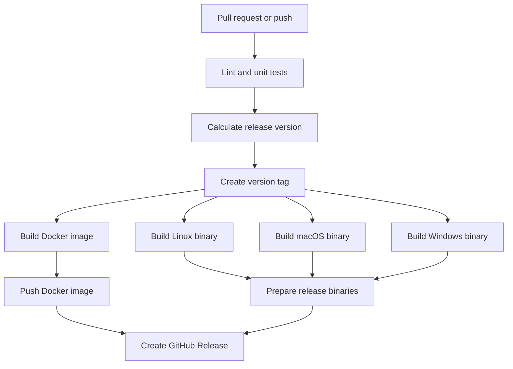

# MDR

MDR is a terminal-based file archive and refinement animation. The project is
also a small learning lab for Python packaging, testing, Docker, CI/CD, version
control, and release management.

## Run locally

The application needs Python 3.9 or newer and a real terminal.

```bash
python3 -m pip install -r requirements.txt
python3 app/index.py
```

Quit with `q` or `Ctrl+C`.

Use a custom configuration or artwork:

```bash
python3 app/index.py --config app/config.json
python3 app/index.py --image path/to/art.png
```

## Tests and linting

Install development dependencies and run the checks locally:

```bash
python3 -m pip install -r requirements-dev.txt
ruff check app tests
python3 -m unittest discover -s tests -v
```

The reusable custom action at [.github/actions/checks/action.yml](.github/actions/checks/action.yml)
runs these same checks in GitHub Actions.

## Docker

Build and run the Linux container:

```bash
docker compose build
docker compose up
```

Run the tests inside the container:

```bash
docker compose run --rm app python3 -m unittest discover -s tests -v
```

Docker provides a reproducible Linux environment. It does not create native
Windows or macOS binaries.

### Publish the Docker image

The `docker.yml` workflow builds the image on pull requests without publishing
it. It publishes to Docker Hub only after code is pushed to `main` or after a
version tag is created. Configure these repository secrets before pushing:

- `DOCKERHUB_USERNAME`: Docker Hub username
- `DOCKERHUB_TOKEN`: Docker Hub access token, not your password

The published image is available as:

```bash
docker pull ahmadabdelwhab/sodiummdr:latest
```

Version tags such as `v0.1.0` publish both `v0.1.0` and `0.1.0` image tags.

## Build binaries

PyInstaller must build on the operating system targeted by the binary.

macOS and Linux:

```bash
chmod +x scripts/build.sh
./scripts/build.sh
```

Windows PowerShell:

```powershell
.\scripts\build.ps1
```

The output is `dist/mdr` on macOS and Linux, or `dist/mdr.exe` on Windows.

Download the latest ready-to-run binaries from the [GitHub Releases page](https://github.com/Ahmadabdelwhab/MDR/releases/latest):

- Linux: `mdr-linux`
- macOS: `mdr-macos`
- Windows: `mdr-windows.exe`

The build script bundles the default JSON configuration and Pillow support.
See [BUILD.md](BUILD.md) for more details.

macOS may warn that an unsigned binary cannot be verified. For a binary you
built yourself, run `xattr -d com.apple.quarantine ./dist/mdr`, or approve it
with Finder's **Open** command. Public macOS releases require Apple Developer
ID signing and notarization.

## GitHub Actions

The repository uses one pipeline in `pipeline.yml`:

1. Run linting and unit tests.
2. Build the Docker image and native binaries after checks pass.
3. On a version tag, publish the Docker image and binaries.
4. On a successful push to `main`, create the next patch version tag.

Pull requests build and validate everything but never publish artifacts.
Newer runs cancel older runs for the same branch or tag.

### Pipeline DAG



## Releases

Every successful push to `main` calculates and creates the next patch version
tag first. That tag is reused in the binary filenames, Docker image tags, and
GitHub Release details.

### Commit message rules

Use Conventional Commit messages:

```bash
git commit -m "feat: add image support"
git commit -m "fix: remove fifth basket"
git commit -m "chore: update dependencies"
```

Commit types describe the change, but every successful push to `main` creates a
patch release. Use lowercase types followed by a colon and a short description.

The initial version is `0.1.0`. To create a version manually, push a semantic
version tag:

```bash
git tag v0.1.0
git push origin v0.1.0
```

Generated binaries are kept out of Git history and attached to the GitHub
Release as downloadable assets.

## Project layout

```text
app/                    Application modules and bundled config
tests/                  Unit tests
scripts/                Platform build entrypoints
.github/workflows/      CI, build, and release automation
Dockerfile              Linux container image
docker-compose.yaml     Local container commands
requirements*.txt       Runtime, development, and build dependencies
```
